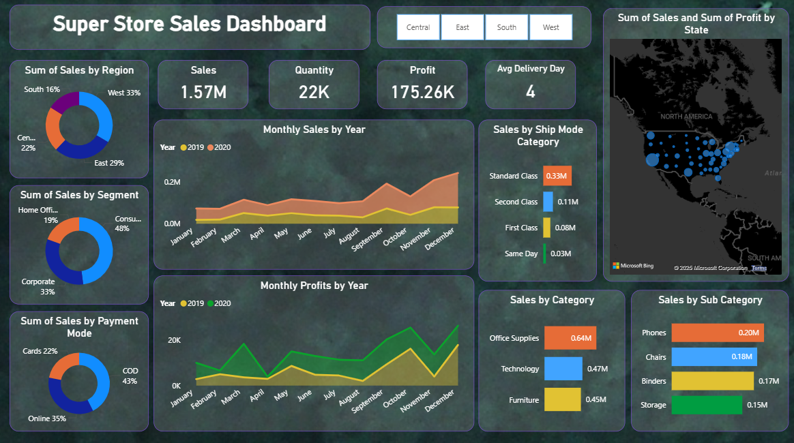
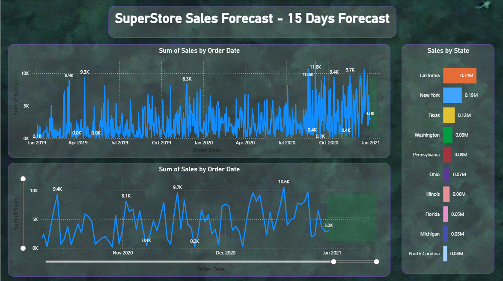

# 📊 SuperStore Sales Analytics & Forecasting Dashboard (Power BI)

An **end-to-end Business Intelligence project** built using **Power BI**, focusing on sales performance analysis, profitability insights, and short-term demand forecasting for a retail superstore dataset.

---

## 📌 Project Overview

The **SuperStore Sales Dashboard** provides a comprehensive view of:

- Sales & profit performance  
- Regional and state-wise trends  
- Customer segments & product categories  
- Shipping efficiency  
- **15-day sales forecast** for demand planning  

This project transforms raw transactional data into **actionable business insights** using interactive and visually intuitive dashboards.

---

## 🖼️ Dashboard Preview

### 🔹 Sales Performance Dashboard


### 🔹 15-Day Sales Forecast Dashboard


---

## 🔍 Analytical Insights

### 📍 Sales Analysis
- Sales breakdown by **Region, State, Category, Sub-Category**
- Customer segmentation (Consumer, Corporate, Home Office)
- Payment mode contribution (COD, Online, Cards)

### 🚚 Shipping & Delivery
- Performance comparison across shipping modes  
- Impact of delivery time on profitability

### 🌎 Geographic Insights
- State-wise sales and profit distribution using map visuals  
- Identification of high-performing and underperforming regions

### 📊 Time-Series Trends
- Monthly sales and profit trends (2019–2020)
- Seasonal demand pattern identification

### 🔮 Forecasting
- **15-day sales forecast** using Power BI analytics
- Confidence interval visualization
- Supports inventory and demand planning

---

## 🛠️ Tools & Technologies

- **Power BI**
- **Power Query (ETL & Data Cleaning)**
- **DAX (Measures & Calculated Columns)**
- **Time-Series Analysis**
- **Data Visualization**

---

## 🧠 Skills Demonstrated

- Business Intelligence & Data Modeling  
- Data Transformation (ETL)  
- KPI Design & Dashboard Storytelling  
- Forecasting & Trend Analysis  
- Geo-spatial Visualization  

---

## 📂 Project Structure

```
SuperStore-Sales-Dashboard/
│
├── SuperStore_Sales_Dataset.csv
├── SuperStore_Sales_Dashboard.pbix
├── assets/
│   ├── sales_dashboard.png
│   └── sales_forecast.png
└── README.md
```

---

## 🎯 Business Impact

- Enables data-driven decision-making  
- Highlights high-performing regions and products  
- Supports proactive planning using short-term forecasts  

---

## 🚀 Future Enhancements

- Integrate **ML-based forecasting**
- Add **anomaly detection**
- Automate refresh using cloud data sources
- Profit margin & discount impact analysis

---

## 👤 Author

**B M Bharath**  
📊 Data Analytics | Business Intelligence | Power BI  
🔗 GitHub: https://github.com/bm-bharath  
🔗 LinkedIn: https://www.linkedin.com/in/bmbharath83/
